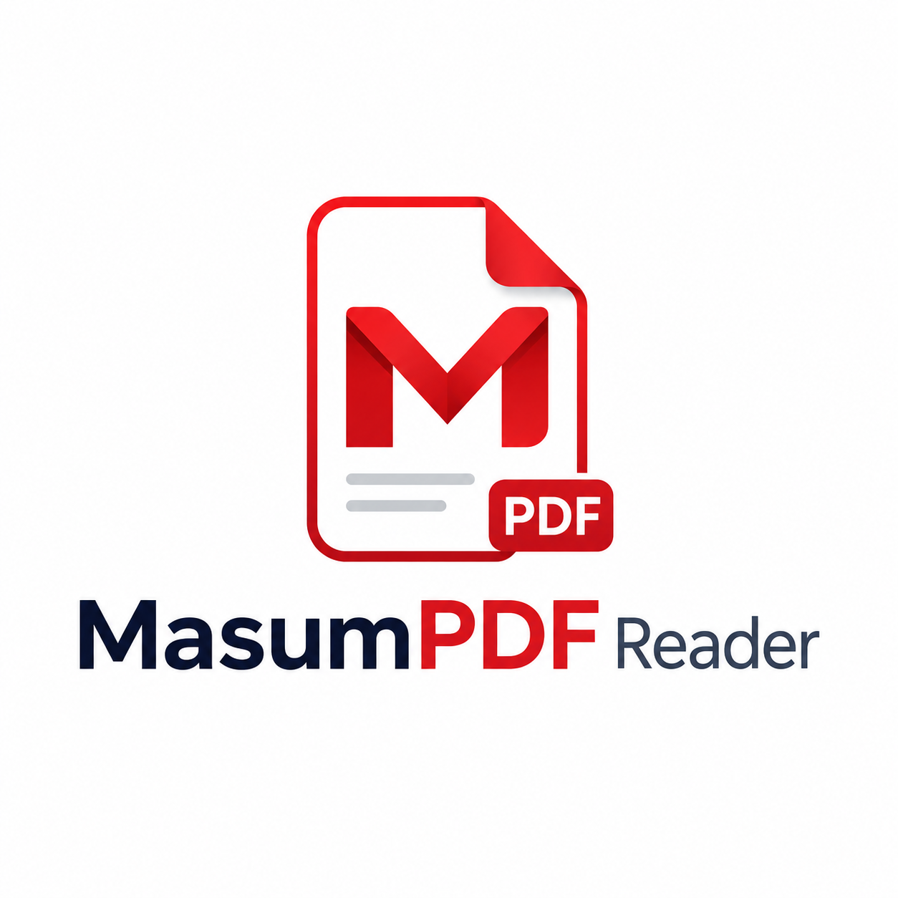

  

<h1 align="center">MasumPDF Reader</h1>

  A free, open-source desktop PDF reader, editor and comparison tool — built in Python. 
  <strong>For education purpose only.</strong>

  
  
  

---

## Download & Install (Windows)

1. Go to the **[Releases](../../releases)** page (right side of this repo).
2. Download **`MasumPDF-Reader-Setup.exe`** from the latest release.
3. Run it and follow the simple install wizard.

That's it. The installer puts a **MasumPDF Reader** icon on your Desktop.

> ⏱️ **Please be patient — the first install takes about 15–20 minutes**
> (depending on your internet speed). It downloads around **800 MB** of
> components the first time. This is normal — leave it running and let it
> finish. It only happens once; after that the app opens instantly. You need
> an internet connection during the install.

## About

MasumPDF Reader is a desktop application for working with PDF files. You can
read, edit, annotate, sign, organize, convert, OCR, compare, compress, fill
forms, and protect PDFs — all from one window. It is written in Python with
PySide6 (Qt) and PyMuPDF.

This project was created by **Chowdhury Mohammad Masum Refat** and is released
under the MIT License. It is intended for education purposes.

## Features

- **Read & view** — continuous, single, and two-page modes; zoom, rotate, fit, fullscreen; dark and light themes
- **Search** the full document
- **Annotate** — highlight, sticky notes, comments, stamps
- **Edit** — Edit Mode (click any line and type), add text, insert images, color a line, change text color, headers & footers
- **Undo & erase** — undo any edit (Ctrl+Z) or click to delete a single annotation
- **Organize pages** — merge, split, extract, rotate, insert, delete
- **Sign & forms** — place signatures, prepare and fill form fields
- **Compare two PDFs** — word-level, reflow-aware comparison with a color-coded report:
  - 🟩 green = added &nbsp; 🟥 red = removed &nbsp; 🟦 blue = moved (reflow)
  - detects figure / image changes (dashed orange box)
  - downloadable PDF report with bookmarks and "jump to changes"
- **Convert** — PDF ↔ images, PDF → text, PDF → DOCX, OCR scanned PDFs
- **Compress, encrypt/decrypt, edit metadata**
- **Print** with a custom print dialog (page range, copies, grayscale, live preview)
- **Clickable links** — table-of-contents and web links work inside the page
- **Check for updates** — the app checks this GitHub page for new versions

## Uninstall

Open **Windows Settings → Apps**, find **MasumPDF Reader**, and click
**Uninstall**. (Python is left in place since other programs may use it.)

## Built with

- [PySide6](https://doc.qt.io/qtforpython/) — the Qt GUI framework
- [PyMuPDF](https://pymupdf.readthedocs.io/) — PDF rendering and editing
- [Pillow](https://python-pillow.org/), [NumPy](https://numpy.org/) — image handling and comparison
- [pypdf](https://pypdf.readthedocs.io/), [reportlab](https://www.reportlab.com/) — PDF utilities

## Honest notes

- This is a student / education project, not a commercial product. It does its
  job well, but it is smaller in scope than paid tools and may have rough edges.
- **First install is slow** (about 15–20 minutes, ~800 MB download) because it
  fetches all the components. This is one-time only.
- **Editing existing text** keeps the original font for standard fonts
  (Times, Helvetica, etc.). For unusual embedded fonts, it uses the closest
  matching font, so it may not be pixel-identical — the same limit other PDF
  editors have.
- The PDF comparison is **text-and-figure based**. It catches text changes
  precisely and flags changed figures, but it is not pixel-perfect on every
  scanned or image-only document.
- Scanned PDFs should be run through OCR first for best comparison results.
- The author name and license are checked at startup; the app is meant to be
  used and shared with credit kept intact.

## License

MIT License — © 2026 Chowdhury Mohammad Masum Refat. See [LICENSE](LICENSE).

You are free to use, study, modify and share this software, with the license
and author credit kept in place.
